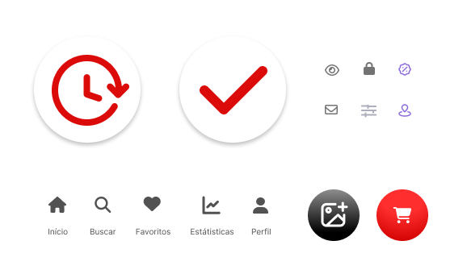

# Template padrão do site

Layout padrão do sistema.


 Abaixo estão as guias de estilo utilizadas no projeto.

## Design

**Layout geral (desktop / mobile):**
- **Header (mobile):** logo centralizada, barra de busca central, ícones de ação (favoritos, perfil, carrinho) à direita.  
- **Navegação (mobile):** bottom navigation com ícones principais (Início, Buscar, Favoritos, Perfil, Carrinho).  
- **Conteúdo:** grid responsiva de cards de produto (1 colunas mobile, 2 colunas em tablet, 4 3m desktop conforme breakpoint).  
- **Footer:** (desktop) informações de suporte e links úteis (Termos, Privacidade, Contato).

**Localização do Logo:**  
- Posição central no header; versão reduzida (square) para utilização em bottom nav e favicon.

**Menus padrões:**  
- Menu principal (cardápio), dropdown/mega menu para filtro de categorias complexas, menu de usuário (perfil, pedidos, favoritos).

**Breakpoints recomendados (mobile-first):**
- `--sm`: 360px (telefones pequenos)  
- `--md`: 768px (tablets)  
- `--lg`: 1024px (laptops)  
- `--xl`: 1440px (desktop grande)

---

## Cores

> Paleta de cores principal utilizada no projeto:

- **Primária:**  
  - `--color-primary-1: #FC2C2C`  
  - `--color-primary-2: #EC1C1C`  
  - `--color-primary-3: #D20503`

- **Secundária:**  
  - `--color-secondary-1: #F6F1FF`  
  - `--color-secondary-2: #AA91E8`  
  - `--color-secondary-3: #8C6CDA`

- **Neutras / Tipografia:**  
  - `--color-white: #FFFFFF`  
  - `--color-surface: #F9F9F9`  
  - `--color-grey-1: #D9D9E1`  
  - `--color-grey-2: #525252`  
  - `--color-black: #000000`

---

## Tipografia

- **Fonte Primária (Títulos):** *Inter* — pesos: Semibold / Bold  
  - Uso: Título de páginas, títulos de seção, labels importantes.  
  - Escala sugerida: 26px (h1), 22px (h2), 16px (h3), 14px (h4), 12px (h5), 10px (h6).  
  - Line-height: 110%.

- **Fonte Secundária (Valores / Monoespaço):** *JetBrains Mono* (Regular & Medium) — usada para valores, preços, e contagens numéricas.  
  - Escala sugerida: 24px → 12px, line-height 130%.

- **Corpo de texto:** Inter Regular 14px - 16px, line-height 1.5.

**Exemplos de classes:**
- `.h1 { font-family: 'Inter', sans-serif; font-weight: 600; font-size: 26px; line-height: 1.1 }`  
- `.price { font-family: 'JetBrains Mono', monospace; font-weight: 400; font-size: 18px }`

---

## Iconografia



**Ícones utilizados e função:**
- `home` → voltar à tela inicial / categorias.  
- `search` → abrir pesquisa.  
- `heart` → favoritos.  
- `cart` → abrir carrinho / checkout.  
- `user` → perfil / login.  
- `clock` → Aguardando pagamento / status.  
- `plus` / `image` → adicionar imagem.  
- `check` → confirmar pagamento.
- `return` → retornar página.
- `mail` / 'passward' → input login.
  
> Ícones vetoriais (SVG).

---

## Estilos CSS (exemplo prático)

> Defina variáveis e estilos base no arquivo `styles/base.css` ou `styles/variables.css`.

```css
:root {
  --color-primary-1: #FC2C2C;
  --color-primary-2: #EC1C1C;
  --color-primary-3: #D20503;
  --color-secondary-1: #F6F1FF;
  --color-secondary-2: #AA91E8;
  --color-secondary-3: #8C6CDA;
  --color-white: #FFFFFF;
  --color-surface: #F9F9F9;
  --color-grey-1: #D9D9E1;
  --color-grey-2: #525252;
  --color-black: #000000;

  --radius-sm: 8px;
  --radius-md: 16px;
  --shadow-sm: 0 1px 3px rgba(0,0,0,0.08);
  --gap: 16px;
}

/* Reset / base */
html, body {
  font-family: 'Inter', sans-serif;
  color: var(--color-black);
  background: var(--color-white);
  margin: 0;
}

/* Header */
.header {
  display: flex;
  align-items: center;
  justify-content: space-between;
  padding: 12px 16px;
  background: var(--color-white);
  box-shadow: var(--shadow-sm);
}

/* Product Card */
.product-card {
  border-radius: var(--radius-md);
  background: var(--color-surface);
  padding: 12px;
  display: flex;
  flex-direction: column;
  gap: 8px;
}

/* Botão primário */
.btn-primary {
  background: linear-gradient(90deg, var(--color-primary-1), var(--color-primary-2));
  color: var(--color-white);
  padding: 10px 14px;
  border-radius: 12px;
  border: none;
  cursor: pointer;
}

/* Grid responsivo */
.grid-products {
  display: grid;
  grid-template-columns: repeat(2, 1fr);
  gap: var(--gap);
}

@media (min-width: 768px) {
  .grid-products { grid-template-columns: repeat(3, 1fr); }
}
@media (min-width: 1024px) {
  .grid-products { grid-template-columns: repeat(4, 1fr); }
}
